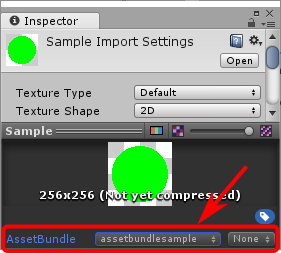
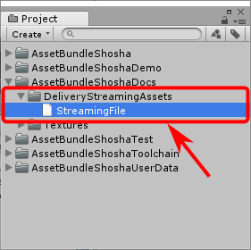
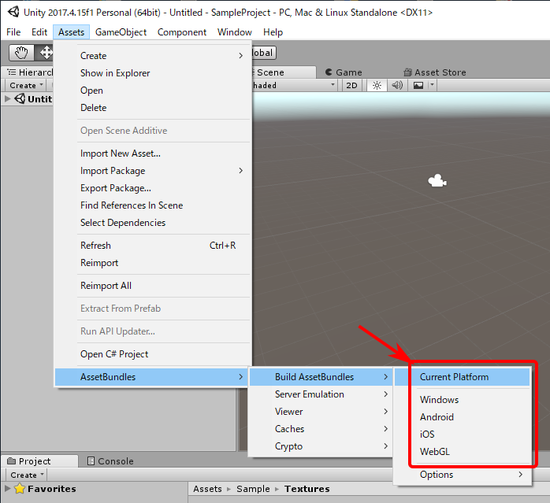
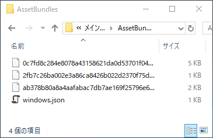
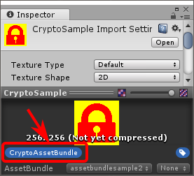

# AssetBundleShosha
所謂オレオレAssetBundleManagerです。  
アセットバンドル構築時から積極的に介入する事でマネージャーだけでは対応出来ない事も扱います。


## 出来る事
- アセットバンドルの構築・配信・利用(バリアント・依存関係対応)
- ストリーミングアセットの配信・利用(バリアント対応)
- アセットバンドルの暗号化
- ダウンロードサイズ取得
- ダウンロード進捗取得
- ネットワークエラー発生時のリトライ支援
- アセットバンドルを作成する事無くエディタ上でアセットを提供するサーバーエミュレーション機能


## 使用方法
### データ構築
1. アセットバンドルはInspector下部のアセットバンドル欄にアセットバンドル名・バリアント名を設定する  
	
1. 配信ストリーミングアセットは```DeliveryStreamingAssets```ディレクトリ以下に保存する  
	
1. 「```Assets```/```AssetBundles```/```Build AssetBundles```/```～```」を実行する  
	
1. ```AssetBundles```ディレクトリ以下に配信データが生成される  
	

### データ参照
1. 破棄されない```GameObject```に```AssetBundleManager```コンポーネントを付加する  
1. アセットバンドルマネージャーコンポーネントを初期化する  
	```csharp
	var baseURL = "http://127.0.0.1/AssetBundles/"; //データ構築で作成したファイル群が在るURL
	yield return AssetBundleManager.Instance.Initialize(baseURL);
	```
1. アセットバンドルはInspector下部のアセットバンドル欄に設定したアセットバンドル名で```LoadAssetBundle```する  
アセットバンドルのロード待ちやアセットの取得方法はUnity標準の使用方法と同様
	```csharp
	var assetBundle = AssetBundleManager.Instance.LoadAssetBundle("assetbundlesample");
	yield return assetBundle;
	var loadRequest = assetBundle.LoadAssetAsync<Texture>("Sample");
	yield return loadRequest;
	var texture = (Texture)loadRequest.asset;

	//アセットバンドルが不要になれば「Dispose()」を呼ぶ (Unload()では無いので注意)
	//取得したテクスチャ等はアセットバンドル破棄後も使用可能
	assetBundle.Dispose();
	```
1. 配信ストリーミングアセットは```DeliveryStreamingAssets```ディレクトリからの相対パス(拡張子無し)の手前に```DeliveryStreamingAssets:```を付けた名前で```LoadAssetBundle```する  
ロード後は```deliveryStreamingAssetPath```にてファイルパスを取得する
	```csharp
	var deliveryStreamingAsset = AssetBundleManager.Instance.LoadAssetBundle("DeliveryStreamingAssets:StreamingFile");
	yield return deliveryStreamingAsset;
	var deliveryStreamingAssetPath = deliveryStreamingAsset.deliveryStreamingAssetPath;

	//配信ストリーミングアセットが不要になれば「Dispose()」を呼ぶ (Unload()では無いので注意)
	//取得したパスは配信ストリーミングアセット破棄後も使用可能
	deliveryStreamingAsset.Dispose();
	```


## 特殊な使い方
### 暗号化
アセットバンドルの暗号化は基本的にデメリットしかないのでお勧めしません。  
ファイル単位で暗号化するかしないかを設定出来る様にしているので最低限の暗号化で済む様に厳選した方が良いです。  
配信ストリーミングアセットは暗号化出来ません。

1. 「```Assets```/```AssetBundles```/```Crypto```/```Create Crypto Key```」を実行する
1. ```Assets```/```AssetBundleShoshaUserData```/```Scripts```ディレクトリに```AssetBundleCryptoKey```スクリプトが作成される
1. ```AssetBundleCryptoKey```スクリプトの中の```AssetBundleCryptoPassword```プロパティに暗号化パスワードを設定する(文字長制限無し)
	```csharp
	private static string AssetBundleCryptoPassword {get{
	    //Input Your Password!
	    return @"XxXxXxXxXxXxXxXxXxXxXxXxXxXxXxXx";
	}}
	```
	(文字列ではなくバイナリで指定したい場合は```byte[16]```の値を返す様に```AssetBundleCryptoKey```プロパティを書き換える)
1. 暗号化したいアセットバンドルに「```CryptoAssetBundle```」ラベルを付ける  
	  
	(全アセットバンドルを暗号化したい場合は「```Assets```/```AssetBundles```/```Build AssetBundles```/```Options```/```Force Crypto```」を有効にする)
1. 通常通りデータ構築・データ参照する

### ダウンロード進捗表示
```AssetBundleShosha.IProgressReceiver```を実装したコンポーネントを用意し、```AssetBundleManager```コンポーネントの```Progress Receiver```に設定する
```csharp
public class ProgressSample : MonoBehaviour, AssetBundleShosha.IProgressReceiver {
    public void ProgressStart() {
        //読み込みが始まると呼ばれる
    }
    public void ProgressUpdate(float progress) {
        //進捗が更新されると呼ばれる
    }
    public void ProgressFinished() {
        //読み込みが終わると呼ばれる
    }

    public void ProgressErrorStart() {
        //読み込み中にエラーが発生すると呼ばれる
    }
    public void ProgressErrorFinished() {
        //エラーが解消されると呼ばれる
    }
}
```

### ネットワークエラー発生時のリトライ
```AssetBundleShosha.IErrorHandler```を実装したコンポーネントを用意し、```AssetBundleManager```コンポーネントの```Error Handler```に設定する
```csharp
public class ErrorHandlingSample : MonoBehaviour, AssetBundleShosha.IErrorHandler {
    public void Error(AssetBundleShosha.IErrorHandle handle) {
        //エラーが発生すると呼ばれる
        //リトライするなら「handle.Retry()」、エラーを無視するなら「handle.Ignore()」を呼ぶ
        //翌フレームに持ち越してもOK
    }
}
```
一部の読み込みのみエラー処理を変えたい場合は```LoadAssetBundle```の戻り値にエラーハンドラーを設定する
```csharp
public class ErrorHandlingSample2 : MonoBehaviour {
    protected virtual void Start() {
        var assetBundle = AssetBundleManager.Instance.LoadAssetBundle("...");
        assetBundle.errorHandler = new ErrorHandler();
    }
    private class ErrorHandler : AssetBundleShosha.IErrorHandler {
        public void Error(AssetBundleShosha.IErrorHandle handle) {
            //...
        }
    }
}
```

### エディタ上に於いてアセットバンドルを作成せずにデータを参照
1. 「```Assets```/```AssetBundles```/```Server Emulation```」を```Load Assets Direct```に設定する  
1. 通常通り```LoadAssetBundle```を使って読み込む```LoadAssetBundle```の戻り値に設定する


## 注意事項
### アンロード
アンロードは必要ありません。  
アセットバンドルはガベージコレクション対象ですので、参照が無くなればいずれアンロードされます。  
即時にアンロードしたい場合は```Dispose```すれば良いです。

### 多重読み込み
同じアセットバンドルを複数ロードしてもalready loadedエラーは発生しません。  
内部で良しなに取り回します。  
多重読み込みしている場合に即時アンロードを行うには重複している全てのアセットバンドルが```Dispose```される必要があります。

### データ更新
データが更新されたかを検知する方法は**現在のところ**ありません。  
データが更新された場合は目録を読み直さなければいけない為、```Initialize```を呼ぶ必要があります。  
```Initialize```を超えて保持し続けたアセットバンドルにアクセスした場合、```ObjectDisposedException```が投げられる予定です。

### 異なるプラットフォームの同居
Unity標準機能と違いプラットフォーム名でディレクトリを作成しませんが、代わりに1ディレクトリに全てのプラットフォームを同居出来ます。
配信ストリーミングアセットが在る場合に異なるプラットフォームのデータを同居させようとすると同名ファイルが在りますが、被るファイルは全て同一ファイルですので上書いても支障はありません。


## LICENSE
Boost Software License, Version 1.0


